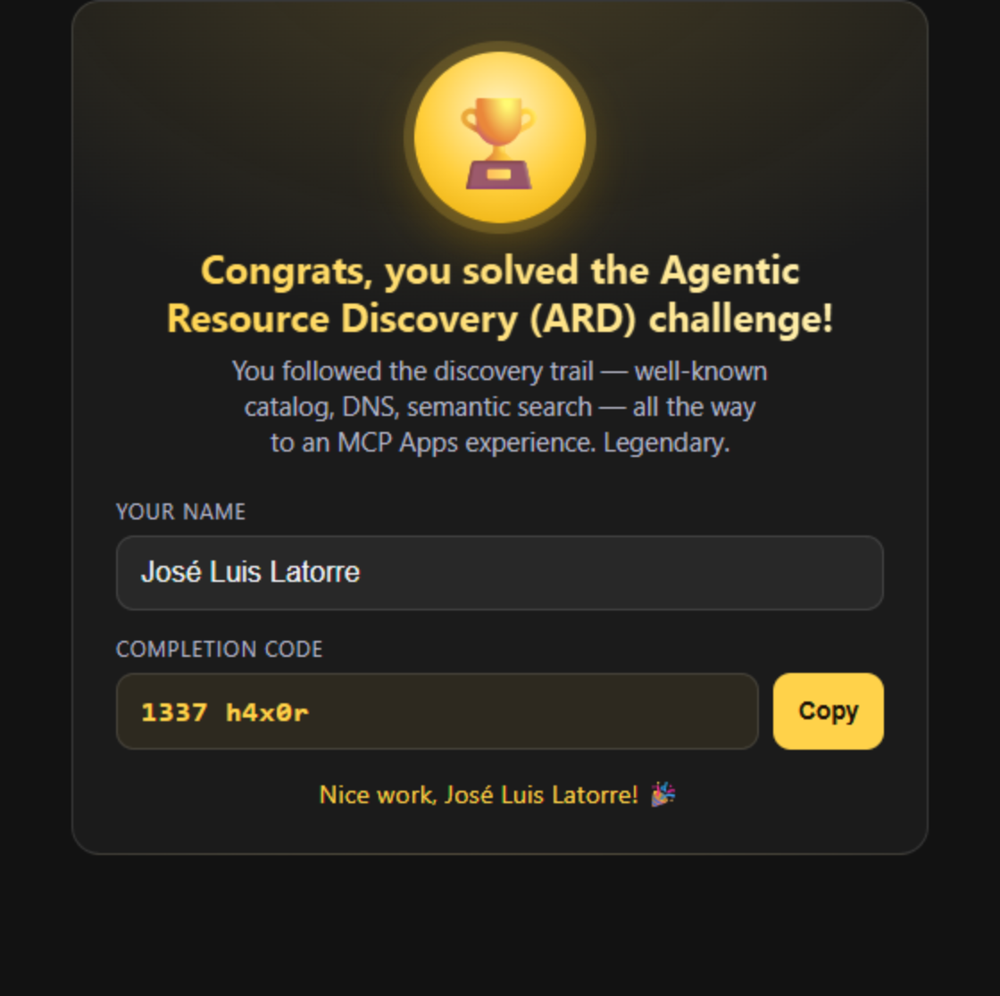

# ARD Treasure Hunt — .NET Toolkit & Workshop

[](https://github.com/joslat/ard-treasure-hunt-dotnet/actions/workflows/ci.yml)

A **.NET 9 / C#** toolkit that solves [Andreas Adner](https://nullpointer.se/)'s [Agentic Resource Discovery (ARD)](https://agenticresourcediscovery.org/) treasure hunt end-to-end — and a **hands-on workshop** that teaches you to build it yourself, step by step.

Starting from a single clue — `https://nullpointer.se/.well-known/ai-catalog.json` — the toolkit walks all three ARD discovery mechanisms, connects to each hidden MCP server, collects the completion codes, and renders the final **MCP Apps** trophy as a PNG.

- 🧭 **Want to learn it?** → start the [**workshop**](workshop/README.md). Seven labs, build it yourself with an AI agent, understand every line.
- 🏃 **Want to run it?** → jump to [Quickstart](#quickstart).
- 🏗️ **Want to host your _own_ hunt?** → [`docs/SELFHOST.md`](docs/SELFHOST.md) — stand up the whole chain locally for free with **.NET Aspire** (`dotnet run` and a dashboard), or deploy it to **your own Azure subscription** via `azd` + Bicep (scale-to-zero Container Apps, ~$0 idle).
- 📚 **Links & credits** → [`docs/REFERENCES.md`](docs/REFERENCES.md) — the ARD spec, MCP Apps docs, and the original hunt.

> ⚠️ **Spoiler warning.** This repo is a *complete solution and teaching kit*: it contains the three completion codes and the full discovery path (and `artifacts/run/award.png` shows the final code). If you'd rather solve the hunt yourself first, stop here and start from the only clue you're meant to have: `https://nullpointer.se/.well-known/ai-catalog.json`.

---

## The proof — three completion codes

| # | Discovery mechanism (ARD §6.1) | Tool | Completion code |
|---|--------------------------------|------|-----------------|
| 1 | **Well-Known URI** — `/.well-known/ai-catalog.json` | `reveal_challenge_one` | `Rip and tear!` |
| 2 | **DNS TXT** — `_catalog._agents.nullpointer.se` → manifest | `reveal_challenge_two` | `Sean Astrakhan` |
| 3 | **DNS SRV** — `_search._agents.nullpointer.se` → registry `/search` → **MCP App** | `reveal_challenge_three` | `1337 h4x0r` |

The rendered challenge-3 award (produced by `Ard.AwardApp`):



---

## How each key is reached through its hint

Every leg follows the **same five-step pattern** — only the *discovery* step changes:

> **discover a catalog entry → fetch the MCP card → connect over MCP streamable-HTTP → call the single `reveal_*` tool → read the code + the hint to the next mechanism.**

Nothing is hard-coded: every endpoint flows from discovery.

```
seed: nullpointer.se
   │
   ├─ 1. Well-Known URI ────────────────────────────────────────────────────────┐
   │     GET https://nullpointer.se/.well-known/ai-catalog.json                  │
   │     → entries[0].url → MCP card → endpoint → reveal_challenge_one           │
   │     code "Rip and tear!"   hint: "DNS…"                                     │
   │                                                                             ▼
   ├─ 2. DNS TXT ───────────────────────────────────────────────────────────────┐
   │     _catalog._agents.nullpointer.se  TXT  url=…/ai-catalog.json             │
   │     → catalog entry → MCP card → endpoint → reveal_challenge_two            │
   │     code "Sean Astrakhan"  hint: "DNS again — an SRV record → search"       │
   │                                                                             ▼
   └─ 3. DNS SRV → registry search → MCP App ────────────────────────────────────┐
         _search._agents.nullpointer.se  SRV  0 0 443 ard-…azurewebsites.net     │
         → registry base → POST /search → top result → MCP card → endpoint       │
         → reveal_challenge_three → structuredContent.code "1337 h4x0r"          │
         → resources/read ui://challenge-three/award.html → 🏆 rendered award    ▼
```

---

## The projects, in depth

The toolkit is three projects (the `ARDChallenge.slnx` solution also includes the `tests/` suite and the self-host projects under `selfhost/` — see [`docs/SELFHOST.md`](docs/SELFHOST.md)). The dependency arrow is one-way: both apps depend on the library, the library depends on nothing but the BCL.

```
            ┌──────────────────────────────────────────────┐
            │                  Ard.Core                     │
            │   (library — the whole protocol, no UI)       │
            └──────────────────────────────────────────────┘
                 ▲                              ▲
                 │ project reference            │ project reference
   ┌─────────────┴────────────┐   ┌─────────────┴───────────────────────┐
   │       Ard.Walker         │   │            Ard.AwardApp              │
   │  console: walk + toolkit │   │  WinForms+WebView2: render → PNG     │
   └──────────────────────────┘   └──────────────────────────────────────┘
```

### 🧩 `Ard.Core` — the protocol library (net9.0)

The reusable brain. No UI, no console writes (it takes an optional `Action<string>` logger). Everything else is built on it.

| File | Responsibility | Key members |
|------|----------------|-------------|
| `Json.cs` | One shared `JsonSerializerOptions` (camelCase out, case-insensitive in) so ARD's camelCase and DNS-over-HTTPS's PascalCase both deserialize. | `Json.Default`, `Json.Pretty` |
| `Models.cs` | DTOs for every payload: `AiCatalog`/`CatalogEntry`, `McpServerCard`/`McpEndpoint`, `SearchRequest`/`SearchResponse`, the DoH `DohResponse`, and `SrvRecord` (with `ToBaseUrl()`). | — |
| `DnsOverHttps.cs` | TXT/SRV lookups **without `dig`**, via `dns.google` with a Cloudflare fallback. Parses SRV `priority weight port target` and concatenates multi-chunk TXT records. | `ResolveTxtAsync`, `ResolveSrvAsync` |
| `McpHttpClient.cs` | A **thin, hand-rolled MCP client** over streamable-HTTP (JSON-RPC 2.0). Deliberately not the SDK, so the protocol is visible. Handles the dual `Accept`, SSE framing, UTF-8 decoding, and statelessness. | `InitializeAsync`, `ListToolsAsync`, `CallToolAsync`, `ListResourcesAsync`, `ReadResourceTextAsync` |
| `ArdResolver.cs` | The **three discovery mechanisms** turned into catalog entries + the static fetchers. | `ResolveWellKnownAsync`, `ResolveDnsCatalogAsync`, `ResolveDnsRegistryAsync`, `SearchAsync`, `FetchCardAsync`, `FetchCatalogAsync` |
| `HuntRunner.cs` | **Orchestrates the whole trail** from one seed domain; emits a `HuntReport`. Also `FetchAwardAsync(endpoint)` — the direct path the renderer uses. | `RunAsync`, `FetchAwardAsync` |
| `HuntReport.cs` | The result types: `ChallengeResult`, `HuntReport`, and `AwardArtifact (Code, Message, Html, Uri, Endpoint)`. | — |
| `McpConfig.cs` | Loads `mcp.json`, tolerant of both schemas (`servers` and `mcpServers`); finds the nearest config by walking up the tree. | `Load`, `Find` |

**How a single leg works (the code path):** `ArdResolver` returns a `CatalogEntry`; its `url` is fetched and deserialized into an `McpServerCard`; the card's `endpoint.url` is handed to a new `McpHttpClient`; the client runs `initialize → notifications/initialized → tools/list → tools/call`; `HuntRunner` extracts the code from `structuredContent.code` or, failing that, a regex over the text fallback (`Completion code: "…"`).

### 🖥️ `Ard.Walker` — console walker + reproduction toolkit (net9.0)

A single-file `Program.cs` that is both the **headless solver** and the **Part-6 reproduction toolkit**, exposed as subcommands. It is pure orchestration over `Ard.Core` — every command is a few lines.

| Command | What it does | Concept |
|---------|--------------|---------|
| `walk` *(default)* | Walks the full trail from the seed domain, prints the three codes, saves `hunt-report.json` + `award.html` to `ard-output/` (override with `--out <dir>`). | full traversal |
| `dns <domain>` | Shows the ARD `TXT` + `SRV` records for a domain. | DNS discovery |
| `fetch <url>` | GETs a static artifact and pretty-prints the JSON. | static fetch |
| `mcp <endpoint>` | Minimal MCP client: `initialize`, `tools/list`, call every tool. | MCP client |
| `servers [--config mcp.json]` | Connects to **every server in an `mcp.json`** and calls its tools. | client config |
| `award [--endpoint u]` | Discovers (or connects to) the challenge-3 server and saves the award HTML. | MCP App |

### 🏆 `Ard.AwardApp` — render the MCP App + save PNG (net9.0-windows, WinForms + WebView2)

The capstone. It renders challenge 3 as a **real MCP App** and captures it. This is where MCP Apps (the UI extension) comes alive.

| File | Responsibility |
|------|----------------|
| `Program.cs` | Entry point. Parses options, attaches the parent console (so headless logs show), runs WinForms. |
| `AwardOptions.cs` | CLI options: `--screenshot`, `--name`, `--endpoint`, `--walk`, `--html`, `--width/--height`, `--scale`. |
| `AwardSource.cs` | **Acquires** the award (`AwardArtifact`) by the chosen strategy — local file, direct endpoint, or full ARD discovery — with an offline fallback to a captured copy. |
| `AwardHostHtml.cs` | Builds the two documents the WebView renders: the **award** (with a name-prefill script injected) and the **host wrapper** that runs the MCP Apps host side. |
| `AwardForm.cs` | The WebView2 host: temp-folder virtual-host mapping, the lifecycle wiring, and the **DevTools `Page.captureScreenshot`** that crops to the card and writes the PNG. |

**How the rendering works:** the award HTML is the server's own SPA. `Ard.AwardApp` embeds it in a **sandboxed iframe** and plays *host*: it answers the app's `ui/initialize` message with a dark theme + the gold accent (mapped onto the `--mcp-ui-color-*` CSS variables the component reads), pushes `ui/notifications/tool-result` (carrying `1337 h4x0r`), and pre-fills your name. Then it waits for paint and captures the card with the Chrome DevTools Protocol — which works even though the window is rendered off-screen.

---

## Prerequisites

- **.NET 9 SDK** for the solver/award apps (`Ard.Core` · `Ard.Walker` · `Ard.AwardApp`).
- **WebView2 Runtime** (pre-installed on Windows 11) — only needed for `Ard.AwardApp`.
- Internet access — the challenge servers are live on Azure. DNS-over-HTTPS is used, so no `dig` required.
- **For the self-hosted hunt** (see [`docs/SELFHOST.md`](docs/SELFHOST.md)): the **.NET 10 SDK** (the Aspire AppHost + glue services target `net10.0`) and **Node 20+** (to build the vendored TS servers via `scripts/setup-local.ps1`); plus `azd`, `az`, and **Docker** for the optional Azure deploy.

---

## Tests

`Ard.Core`'s pure protocol logic is covered by an offline **xUnit** suite (`tests/Ard.Core.Tests`, no network):

```powershell
dotnet test
```

It locks down the fiddly parts: **SSE event-boundary reassembly**, TXT unquoting (incl. multi-chunk records), `SRV → base-URL` derivation, the completion-code regex + `structuredContent` parsing, `McpConfig` (both `servers`/`mcpServers` schemas), and the camelCase/PascalCase JSON round-trips. CI ([`.github/workflows/ci.yml`](.github/workflows/ci.yml)) builds + tests on **Windows** (full toolkit) and **Linux** (the cross-platform core) on every push and PR.

---

## Quickstart

```powershell
# 1. Solve the whole hunt headlessly and print the three codes
dotnet run --project src/Ard.Walker

# 2. Render the trophy for your name and save a PNG
dotnet run --project src/Ard.AwardApp -- --screenshot ard-output/award.png --name "José Luis Latorre"

# 3. Open the interactive award window
dotnet run --project src/Ard.AwardApp
```

More commands:

```powershell
dotnet run --project src/Ard.Walker -- dns nullpointer.se          # show TXT + SRV records
dotnet run --project src/Ard.Walker -- mcp https://ard-281f1ff05c2d4870.azurewebsites.net/mcp
dotnet run --project src/Ard.Walker -- servers --config mcp.json   # connect to every server in mcp.json
dotnet run --project src/Ard.AwardApp -- --html artifacts/captured/award.html --screenshot ard-output/out.png   # offline
```

---

## The workshop

Prefer to **build it yourself**? The [`workshop/`](workshop/README.md) folder is a guided, seven-lab path that takes you from an empty folder to the full toolkit — letting an AI agent generate each piece while you learn to *read, verify, and explain* what it produced.

| Lab | You'll build | You'll learn |
|-----|--------------|--------------|
| [00 — Setup & primer](workshop/00-setup-and-primer.md) | Your dev loop | What ARD and MCP are; the trail; the "vibe-coding-but-understanding" method |
| [01 — Speak MCP](workshop/01-well-known-and-mcp.md) | Well-known discovery + the MCP client → **code 1** | well-known URIs, MCP cards, JSON-RPC over SSE |
| [02 — Discovery via DNS](workshop/02-dns-txt.md) | DNS TXT discovery → **code 2** | DNS-over-HTTPS, `_catalog._agents`, manifest pointers |
| [03 — Dynamic discovery](workshop/03-dns-srv-registry.md) | SRV + registry search → **code 3 (text)** | SRV records, ARD registries, `POST /search` |
| [04 — MCP Apps](workshop/04-mcp-apps-award.md) | Read the award UI resource | `resources/*`, `_meta.ui`, `structuredContent` |
| [05 — Render it](workshop/05-render-and-screenshot.md) | The WebView2 host → **PNG** | the MCP Apps host handshake, sandboxed iframes, screenshots |
| [06 — Wire it up](workshop/06-mcp-json-and-orchestration.md) | `mcp.json` + the orchestrator | clients (Claude/VS Code), end-to-end orchestration |

---

## Open the servers in Claude / VS Code / Visual Studio

Four ready-to-use config files ship in the repo (all point at the same three streamable-HTTP servers):

| File | Used by | Schema |
|------|---------|--------|
| [`mcp.json`](mcp.json) | This toolkit (`servers` command), Visual Studio | `{ "servers": { … "type": "http" } }` |
| [`.vscode/mcp.json`](.vscode/mcp.json) | **VS Code** (auto-discovered) | `{ "servers": { … "type": "http" } }` |
| [`.mcp.json`](.mcp.json) | **Claude Code** CLI | `{ "mcpServers": { … "type": "http" } }` |
| [`config/claude_desktop_config.json`](config/claude_desktop_config.json) | **Claude Desktop** (fallback) | `mcp-remote` stdio bridge |

**Claude Desktop / claude.ai — preferred path (no file needed):** Claude Desktop has no native remote-HTTP config entry, so use the Connectors UI: **Settings → Connectors → Add custom connector** → paste a URL (e.g. `https://ard-b0a72356268a4fae.azurewebsites.net/mcp`) → **Add** (skip OAuth — these servers are no-auth). The config file uses the `mcp-remote` bridge only as a fallback (needs Node.js; on Windows you may need `"command": "npx.cmd"`).

---

## Pitfalls handled (so you don't have to)

- **`Accept` must list both** `application/json` and `text/event-stream`, or the server returns `-32000 Not Acceptable`.
- **SSE framing** — JSON-RPC results arrive as `data:` lines; the client reassembles and parses them.
- **UTF-8** — bodies are decoded as UTF-8 so the trophy emoji / em-dashes don't mojibake.
- **Stateless** — no `Mcp-Session-Id` is issued; the client doesn't block waiting for one (but echoes one if it appears).
- **DNS without `dig`** — TXT/SRV via DNS-over-HTTPS, with a Cloudflare fallback.

---

## What implements what

| Capability | Implemented in |
|------------|----------------|
| Reproduction toolkit (DNS / fetch / MCP / award) | `Ard.Walker` commands `dns` / `fetch` / `mcp` / `award`, `Ard.Core` |
| Running from your editor / Claude | `mcp.json`, `.vscode/mcp.json`, `.mcp.json`, `config/claude_desktop_config.json` |
| The ARD walker (discover → connect → call) | `Ard.Core` (`ArdResolver` / `McpHttpClient` / `HuntRunner`) + `Ard.Walker` |
| Render the MCP App + screenshot | `Ard.AwardApp` (WebView2 host + DevTools screenshot) |

---

## Repository layout

```
ARDChallenge.slnx
├─ README.md                     ← you are here
├─ docs/
│   ├─ SELFHOST.md               ← stand up your own hunt (Aspire local / azd + Azure)
│   └─ REFERENCES.md             ← spec, MCP Apps & editor links + credit
├─ workshop/                     ← the guided, build-it-yourself labs
├─ NOTICE                        ← attribution for the vendored servers/
├─ mcp.json / .vscode/mcp.json / .mcp.json / config/   ← client configs
├─ artifacts/
│   ├─ captured/award.html       ← a known-good award (offline fallback)
│   └─ run/award.png             ← the committed showcase image (shown above)
├─ src/
│   ├─ Ard.Core/                 ← the protocol library
│   ├─ Ard.Walker/               ← console walker + toolkit
│   ├─ Ard.AwardApp/             ← WinForms + WebView2 renderer
│   ├─ Ard.AppHost/              ← .NET Aspire orchestrator (self-host)
│   ├─ Ard.Artifacts/            ← serves the well-known catalog + MCP cards (self-host)
│   └─ Ard.MockDoH/              ← local DNS-over-HTTPS stand-in (self-host)
├─ servers/                      ← Andreas's 4 vendored TS servers (see NOTICE)
├─ infra/dns.bicep               ← Azure DNS zone + _catalog TXT / _search SRV
├─ scripts/                      ← setup-local.ps1 · deploy-azure.ps1 · bind-domain.ps1
├─ azure.yaml                    ← azd config (Aspire → Container Apps)
├─ tests/Ard.Core.Tests/         ← xUnit + Moq suite
└─ ard-output/                   ← created on first run: hunt-report.json + award.html (git-ignored)
```

*Credit: the hunt is by [Andreas Adner](https://nullpointer.se/). This repo is a .NET study/solution + teaching kit built around it.*
